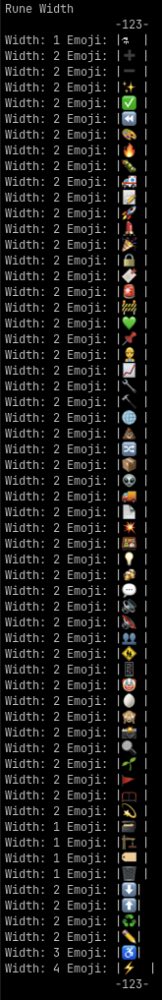
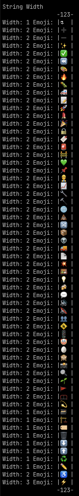

# emoji-alignment

Test case showing emoji alignment with rune width and string width.

These tests have been verified on macOS with both Terminal and iTerm2. Further testing will be required for other platforms and terminals.

## Example

This is an example of the differences in emoji alignment between using the two different methods.

The width shown in each image is the value from their respective function calls.

|                          RuneWidth                           |                         String Width                         |
| :----------------------------------------------------------: | :----------------------------------------------------------: |
|  |  |

